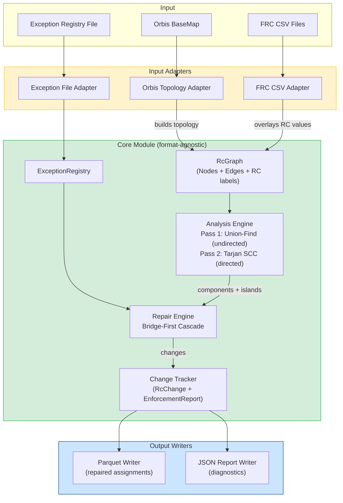

# Routing Class Connectivity Enforcement Module — Design Spec

> **Date:** 2026-04-16
> **Status:** Draft
> **Scope:** Connectivity enforcement module — detects and repairs RC subgraph connectivity violations

---

## 1. Overview

A format-agnostic graph tool that takes an abstract directed graph with RC labels, detects connectivity violations per RC level, and repairs them using a bridge-first cascade strategy. Concrete adapters handle FRC CSV ingestion, Orbis topology loading, Parquet output, and JSON diagnostic reports.

### What This Module Does

- Accepts an abstract directed graph with RC (1–5) labels on edges
- Detects disconnected components per RC subgraph (RC1, RC1+2, ..., RC1–5)
- Repairs violations: promotes nearby lower-RC roads as bridges first, downgrades remaining islands as fallback
- Produces repaired RC assignments (Parquet) and a full diagnostic report (JSON)
- Respects an exception registry of known acceptable dead ends

### What This Module Does NOT Do

- No RC value computation (that's FRC/RATS2's job)
- No feedback/override reconciliation (caller's responsibility)
- No geographic partitioning (caller provides the scoped graph)
- No BaseMap writes (outputs repaired assignments; another system applies them)
- No scheduling or pipeline orchestration

---

## 2. Core Domain Model

The module operates on an abstract directed graph. No Orbis/NDS/Parquet concepts leak into the core.

### Graph Primitives

- **Node** — A junction point (maps to Connector in Orbis). Has an ID.
- **Edge** — A directed road segment between two nodes. Has an ID, an RC value (1–5 or absent), and a direction (forward, reverse, bidirectional).
- **RcGraph** — A collection of nodes and edges. Can produce subgraphs filtered by RC level.

### RC Subgraph Extraction

`subgraph(n)` returns all edges with RC <= n and the nodes they touch. This is the graph on which connectivity is evaluated at level n.

### Exception Model

- **ExceptionRegistry** — A set of edge IDs that are known acceptable dead ends. Loaded from a file (one edge ID per line, optional justification comment). These edges are excluded from violation detection.

### Change Tracking

- **RcChange** — Records a single modification: edge ID, old RC, new RC, reason (downgrade/upgrade), and context (which island, which bridge attempt).
- **EnforcementReport** — Aggregates all changes, component counts before/after, failed bridge attempts, and exception hits.

---

## 3. Connectivity Analysis Engine

Two-pass analysis supporting incremental sophistication.

### Pass 1 — Undirected (Weakly Connected Components)

- Treats all edges as bidirectional regardless of oneway attributes
- Uses Union-Find (disjoint set) algorithm — O(n*alpha(n)), near-linear, handles 340M edges efficiently
- Identifies connected components per RC subgraph
- Catches gross islands (the bulk of the ~1,346 RC1 components observed in production)

### Pass 2 — Directed (Strongly Connected Components)

- Optional, activated by caller via `enableDirectedPass` configuration
- Respects edge direction (oneways) and turn restrictions
- Uses Tarjan's or Kosaraju's algorithm for SCC detection
- Catches subtler violations: directional dead ends, one-way traps

### Turn Restriction Modeling (Pass 2 Only)

A turn restriction `(from_edge, via_node, to_edge) = forbidden` is modeled by expanding the graph into an edge-based representation where nodes become `(via_node, arriving_edge)` pairs. This is a well-known technique for routing graphs and avoids modifying the core node/edge model.

### Output of Each Pass

- List of components per RC level, with member edge IDs
- The largest component flagged as "main"
- All other components flagged as "islands" (candidates for repair)

---

## 4. Repair Engine — Bridge-First Cascade

Processes RC levels top-down: RC1 first, then RC1+2, then RC1+2+3, etc.

### Algorithm (at each level n)

```
1. Extract subgraph(n)
2. Run connectivity analysis -> identify main component + islands
3. For each island:
   a. Skip if all edges are in the exception registry
   b. BRIDGE SEARCH: Find candidate edges with RC > n (lower importance)
      that connect the island to the main component
      - BFS outward from island boundary nodes on edges with RC > n
      - Search within configurable hop radius
      - Rank candidates by: fewest promotions needed, smallest RC jump
      - If viable bridge found -> propose UPGRADE (promote candidate edges to RC n)
   c. If no bridge found -> DOWNGRADE all island edges to RC n+1
   d. Record all changes with full context in the report
4. Apply changes to the graph (so subsequent levels see the updated state)
5. Move to level n+1
```

### Bridge Search Parameters

| Parameter | Default | Purpose |
|-----------|---------|---------|
| `maxBridgeHops` | 10 | Max path length for bridge search |
| `maxPromotions` | 5 | Max edges promoted per bridge |
| `maxRcJump` | 2 | Max RC levels a single edge can be promoted (e.g., RC3->RC1 = 2) |

### Cascade Effect

A downgraded island at RC1 becomes part of the RC2 graph. If still disconnected at RC2, the same logic applies — bridge search, then downgrade to RC3. An edge can cascade all the way to RC5.

### RC5 Islands

Cannot downgrade further. Reported as unresolvable violations — likely indicate missing road segments or topology errors in the BaseMap.

---

## 5. Input/Output Adapters

### Input Adapters

**FRC CSV Adapter:**
- Reads FRC delivery files (`ProductId, Net2Class, CountryCode`)
- Requires an ID mapping to translate ProductIds to the graph's edge IDs
- Populates RC values on edges in the abstract graph

**Orbis Topology Adapter:**
- Reads Orbis BaseMap to build the graph structure (nodes, edges, direction)
- Sources: Connectors (nodes), Road Lines + Ferry Lines (edges), oneways, turn restrictions
- Provides the topology that FRC CSVs lack

These two adapters work together: Orbis adapter builds the graph structure, FRC adapter overlays RC values onto it.

**Exception File Adapter:**
- Reads a simple format: one edge ID per line with optional justification comment
- Populates the ExceptionRegistry

### Output

**Parquet Writer:**
- Writes repaired RC assignments: `edgeId, routingClass, changeType (unchanged/upgraded/downgraded), reason`
- Schema aligned with Orbis conventions for downstream consumption

**Report Writer (JSON):**
- Per RC level: component count before/after, list of islands found
- All changes with full context (edge ID, old RC, new RC, bridge attempt details)
- Exception hits (dead ends that were skipped)
- Unresolvable violations (RC5 islands)
- Summary statistics: total upgrades, total downgrades, islands resolved

---

## 6. Configuration

Single configuration object controlling module behavior.

| Parameter | Type | Default | Purpose |
|-----------|------|---------|---------|
| `maxBridgeHops` | int | 10 | Max path length for bridge search |
| `maxPromotions` | int | 5 | Max edges promoted per bridge |
| `maxRcJump` | int | 2 | Max RC levels a single edge can be promoted |
| `rcLevelsToProcess` | int[] | [1,2,3,4,5] | Which RC levels to enforce (allows partial runs) |
| `enableDirectedPass` | boolean | false | Whether to run SCC analysis after undirected pass |
| `exceptionFilePath` | String | null | Path to exception registry file |

---

## 7. Extensibility

- **Graph adapter interface** — Any new data source (RATS2, future formats) implements the same interface to build the abstract graph. No core algorithm changes needed.
- **Writer interface** — Additional output formats (CSV, database) added by implementing the writer interface.
- **Repair strategy interface** — The bridge-first-then-downgrade logic lives behind an interface. Alternative strategies (downgrade-only, report-only) can be swapped in without touching the analysis engine.

---

## 8. Testing Strategy

### Unit Tests — Core Algorithms

- Small hand-crafted graphs (5–20 nodes) verifying:
  - Connected component detection (undirected and directed)
  - Bridge search finds shortest viable bridge
  - Downgrade cascade works correctly across levels
  - Exception registry skips flagged edges
  - RC5 islands reported as unresolvable
  - Edge cases: single-node islands, self-loops, parallel edges between same nodes

### Unit Tests — Adapters

- FRC CSV parsing (valid, malformed, missing fields)
- Exception file parsing
- Parquet writer produces correct schema
- Report writer produces valid JSON

### Integration Tests — Realistic Scenarios

- Reproduce the Sygic Slovakia PoC scenario: known disconnected components, verify top-down downgrading produces expected results
- Bridge repair scenario: two RC1 islands connected by an RC3 road, verify promotion
- Mixed scenario: some islands bridgeable, some downgraded, some excepted
- Cascade scenario: RC1 island downgraded to RC2, still disconnected, cascades to RC3

### Property-Based Tests

- For any input graph, after enforcement, every RC subgraph is connected (excluding exceptions and RC5 unresolvables)
- No edge's RC value is changed without a corresponding entry in the report
- Total edges in output equals total edges in input (no edges created or destroyed)

### Performance Benchmark (Tracked, Not Blocking)

- Run on synthetic graphs at realistic scale (~1M edges) to verify Union-Find and BFS stay within reasonable time

---

## 9. Architecture Diagram



---

## 10. Key Design Decisions

| Decision | Rationale |
|----------|-----------|
| Format-agnostic core | Future-proofs for RATS2; enables independent testing |
| Bridge-first before downgrade | Preserves road importance where possible; better audit trail |
| Two-pass analysis (undirected then directed) | Ship value fast with Pass 1; refine with Pass 2 |
| Level-by-level cascade (top-down) | Proven pattern (Sygic PoC); easy to reason about |
| Exception registry as input file | Matches existing annual review process; simple and auditable |
| Module does not write to BaseMap | Clean separation of concerns; another system handles application |
| No feedback awareness | Keeps module pure; caller reconciles feedback before/after |
| No geographic partitioning | Caller scopes the graph; module stays focused on graph algorithms |

---

*Based on: [Routing Class Knowledge Base](../routing-class-knowledge-base.md)*
